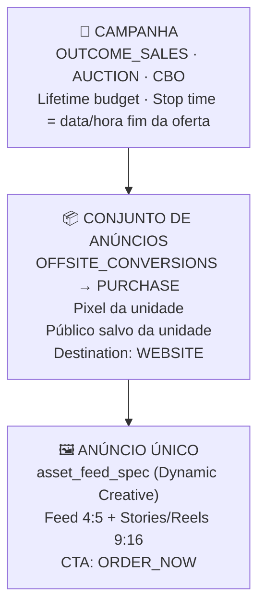

# Template — Configuração de Campanha de Vendas
### Madrugão · Cardápio Digital via Menudino
*Baseado na campanha Hamburger Day Garcia (28/05/2026) — validado e replicável*

---

> [!tip] Como usar este template
> Este documento contém a estrutura completa de uma campanha de vendas para cardápio digital Madrugão. Para replicar em outra unidade, substitua apenas os campos marcados com `⚠️ TROCAR POR UNIDADE`.

---

## 🏗️ Estrutura da Campanha



---

## ⚙️ Configuração Campanha

| Parâmetro | Valor | Observações |
|---|---|---|
| **objective** | `OUTCOME_SALES` | Único aceito pra venda direta |
| **buying_type** | `AUCTION` | Padrão |
| **campaign_lifetime_budget** | `⚠️ TROCAR` (em centavos) | Ex: R$50 = 5000 |
| **campaign_bid_strategy** | `LOWEST_COST_WITHOUT_CAP` | Deixa Meta otimizar livre |
| **campaign_stop_time** | `⚠️ TROCAR` | ISO 8601 com timezone BRT (-03:00) |
| **special_ad_categories** | `[]` | Sem categoria especial |

> [!warning] Budget
> Colocar o budget a nível de campanha (CBO). NÃO colocar budget no adset — a API vai rejeitar com erro de conflito CBO/ABO.

---

## ⚙️ Configuração AdSet

| Parâmetro | Valor | Observações |
|---|---|---|
| **optimization_goal** | `OFFSITE_CONVERSIONS` | Padrão pra venda no site |
| **billing_event** | `IMPRESSIONS` | Padrão |
| **promoted_object** | `{"pixel_id":"⚠️ PIXEL DA UNIDADE","custom_event_type":"PURCHASE"}` | Obrigatório pra OFFSITE_CONVERSIONS |
| **destination_type** | `WEBSITE` | Cardápio externo (Menudino) |
| **end_time** | Mesmo do stop da campanha | Sincronizar |
| **targeting** | Público salvo da unidade (ver abaixo) | Não usar `source_adset_id` — não copia confiável |

### Regras obrigatórias de dispositivo e posicionamento

> [!danger] Regras fixas para TODAS as campanhas Madrugão
> - ✅ **Apenas Celular** — `"device_platforms": ["mobile"]`
> - ❌ Desktop NUNCA selecionado
> - ❌ "Somente quando conectado a uma rede Wi-Fi" NUNCA marcado
> - ❌ **"Anúncios com vários anunciantes"** SEMPRE desselecionar → `"multi_advertiser_enabled": false`
> - ✅ Posicionamento SEMPRE editado manualmente (nunca automático)

#### Posicionamento quando TEM criativo 9:16 (Feed 4:5 + Stories/Reels 9:16)

```json
"device_platforms": ["mobile"],
"publisher_platforms": ["facebook", "instagram", "messenger"],
"facebook_positions": ["feed", "story", "facebook_reels"],
"instagram_positions": ["stream", "story", "reels"],
"messenger_positions": ["story"]
```

#### Posicionamento quando NÃO TEM criativo 9:16 (só Feed)

```json
"device_platforms": ["mobile"],
"publisher_platforms": ["facebook", "instagram"],
"facebook_positions": ["feed"],
"instagram_positions": ["stream"]
```

> ⚠️ Instagram Feed = `"stream"` na API (não `"feed"` — retorna erro 1815508). Facebook Feed = `"feed"`.

---

### Targeting JSON (estrutura-padrão Madrugão)

```json
{
  "geo_locations": {
    "custom_locations": [
      {
        "latitude": "⚠️ LAT DA UNIDADE",
        "longitude": "⚠️ LON DA UNIDADE",
        "radius": 5,
        "distance_unit": "kilometer",
        "country": "BR"
      }
    ]
  },
  "excluded_geo_locations": {
    "custom_locations": [
      "⚠️ EXCLUSÕES DAS OUTRAS UNIDADES (raio 2km cada)"
    ]
  },
  "age_min": 18,
  "targeting_automation": { "advantage_audience": 1 }
}
```

> [!warning] Restrição Meta — age_max
> **NÃO usar `age_max` com Advantage+ ativo.** A Meta rejeita `age_max < 65` com erro 1870189. O limite superior (ex: 55) fica como sugestão no público salvo do Gerenciador, mas via API só `age_min` como hard cap + Advantage+ ON.

---

## ⚙️ Configuração do Anúncio (Ad)

O anúncio usa `asset_feed_spec` para servir imagem certa em cada placement com 1 único ad.

### asset_feed_spec completo

```json
{
  "object_story_spec": {
    "page_id": "⚠️ PAGE_ID DA UNIDADE"
  },
  "asset_feed_spec": {
    "images": [
      {
        "hash": "⚠️ HASH IMAGEM FEED 4:5",
        "adlabels": [{"name": "feed_image"}]
      },
      {
        "hash": "⚠️ HASH IMAGEM STORIES 9:16",
        "adlabels": [{"name": "story_image"}]
      }
    ],
    "bodies": [{"text": "⚠️ COPY PRINCIPAL (body)"}],
    "titles": [{"text": "⚠️ HEADLINE"}],
    "descriptions": [{"text": "⚠️ DESCRIPTION"}],
    "link_urls": [{"website_url": "⚠️ LINK DO CARDÁPIO DIGITAL"}],
    "call_to_action_types": ["ORDER_NOW"],
    "ad_formats": ["SINGLE_IMAGE"],
    "asset_customization_rules": [
      {
        "customization_spec": {
          "publisher_platforms": ["facebook","instagram","audience_network","messenger"]
        },
        "image_label": {"name": "feed_image"}
      },
      {
        "customization_spec": {
          "publisher_platforms": ["facebook","instagram","messenger"],
          "facebook_positions": ["story","facebook_reels"],
          "instagram_positions": ["story","reels"],
          "messenger_positions": ["story"]
        },
        "image_label": {"name": "story_image"}
      }
    ]
  }
}
```

> [!warning] CTA — ORDER_NOW obrigatório
> `BUY_NOW` é **rejeitado** pela Meta em Dynamic Creative + OUTCOME_SALES (erro 1885396: "BUY_NOW is not supported for the objective OUTCOME_SALES in Dynamic Creative Ad Set").
> Usar sempre `ORDER_NOW` ("Pedir Agora") — semanticamente correto pra cardápio digital e aceito pelo Meta.

> [!tip] conversion_domain
> Sempre passar `conversion_domain` no `ads_create_ad` com o domínio do cardápio (ex: `madrugaolanchesgarcia.menudino.com`). Melhora a atribuição do pixel.

---

## 📐 Especificações dos Criativos

| Formato | Uso | Resolução | Ratio | Placements |
|---|---|---|---|---|
| **Feed 4:5** | Fluxo principal | 1254×1254 px (mínimo: 1080×1080) | 4:5 | FB Feed, IG Feed, Reels stream, Marketplace, Audience Network, Messenger Home |
| **Stories/Reels 9:16** | Vertical full-screen | 900×1600 px (mínimo: 1080×1920) | 9:16 | FB Stories, IG Stories, IG Reels, FB Reels, Messenger Stories |

---

## 🔄 Checklist de Replicação por Unidade

Use este checklist ao criar a campanha em uma nova unidade:

### Inputs necessários (coletar antes de criar)

- [ ] **Ad Account ID** da unidade
- [ ] **Page ID** do Facebook da unidade (via `ads_get_ad_account_pages`)
- [ ] **Pixel ID** (via Gerenciador de Eventos — MCP bloqueado por rollout)
- [ ] **Image hashes** da conta destino (fazer upload das imagens na Biblioteca de Mídia da conta destino → copiar hashes)
- [ ] **Link do cardápio digital** da unidade
- [ ] **Targeting JSON** do público salvo da unidade (reconstruir via painel Gerenciador → Públicos)
- [ ] **Budget** e **stop_time** (definir com cliente)
- [ ] **Copy** (body, headline, description) — verificar se menciona endereços corretos
- [ ] **Instagram User ID** (opcional, mas aumenta inventory ~40%)

### Sequência de criação via MCP

```
1. ads_create_campaign  →  obtém campaign_id
2. ads_update_entity (adset targeting)  →  atualiza targeting logo após criar
3. ads_create_ad_set (campaign_id, pixel, end_time)  →  obtém adset_id
4. ads_create_ad (adset_id, asset_feed_spec)  →  obtém ad_id
5. Revisar no Gerenciador
6. ads_activate_entity (campaign) → ads_activate_entity (adset) → ads_activate_entity (ad)
```

> [!danger] Nunca ativar sem revisão no Gerenciador
> Sempre criar em PAUSED, revisar no Gerenciador (targeting, preview do criativo, CTA, link), e só então ativar. Campanha ativa = orçamento gastando.

---

## 📊 Benchmarks por unidade (atualizar conforme dados acumulam)

| Unidade | CTR esperado | CPM esperado | CPA esperado | ROAS esperado | Referência |
|---|---|---|---|---|---|
| **Garcia** | 1,06-1,16% | R$ 6,08-6,14 | R$ 22-28 | 2,0-2,4x | 90 dias: X-FRANGO + X-SALADA |
| **Centro** | 1,01-1,19% | R$ 6,80-7,32 | _a mapear_ | _a mapear_ | 90 dias: campanhas STARKEN |
| Fortaleza | _a mapear_ | _a mapear_ | _a mapear_ | _a mapear_ | — |

---

## 🏷️ Nomenclatura padrão

```
Campanha:  [STARKEN][VENDAS][EVENTO/PRODUTO][DATA?]
AdSet:     [CA][TIPO][EVENTO/PRODUTO][DATA?]
Ad:        [FORMATO] DESCRIÇÃO CURTA DATA
```

Exemplos:
- `[STARKEN][VENDAS][HAMBURGER_DAY][28/05]` → campanha Hamburger Day
- `[STARKEN][VENDAS][DOBRO][X-FRANGO]` → campanha perpétua frango dobro
- `[CA][HAMBURGER_DAY][28/05]` → adset Hamburger Day
- `[FEED+STORIES] HAMBURGER DAY 28/05` → ad multi-placement

---

## 🔗 Implementações desta campanha

| Unidade | Data | Campanha | Status | Documento |
|---|---|---|---|---|
| Garcia | 2026-05-28 | Hamburger Day | 🟢 ATIVA | [[../2026-05-28 Hamburger Day/00 - Briefing]] |
| Centro | 2026-05-28 | Hamburger Day | ⏳ A criar | _criar pasta_ |

---

*Template criado em: 2026-05-28 · Fenice Lab*
