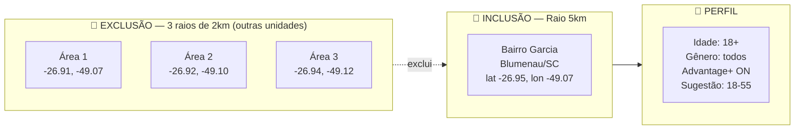

# 🍔 Hamburger Day — Madrugão Garcia
### Dia Mundial do Hambúrguer · 28 de Maio de 2026

---

> [!tip] TL;DR — Campanha em 1 linha
> Campanha de **1 dia** com R$ 50 de budget, objetivo **vendas no cardápio digital**, público hiperlocal do bairro Garcia, criativos em **Feed + Stories simultâneos**, com monitoramento automatizado a cada 2h via cloud.

---

## 🗺️ Estrutura da Campanha

```mermaid
graph TD
    A["🎯 CAMPANHA<br/><b>[STARKEN][VENDAS][HAMBURGER_DAY][28/05]</b><br/>OUTCOME_SALES · CBO · R$ 50 lifetime<br/>Stop: 28/05 23:30 BRT<br/>ID: 120245256118330611"]

    B["📦 CONJUNTO DE ANÚNCIOS<br/><b>[CA][HAMBURGER_DAY][28/05]</b><br/>Otimização: OFFSITE_CONVERSIONS → PURCHASE<br/>Pixel: 2784591895216854<br/>Público: Madrugão Garcia &#35;1 · Blumenau 5km<br/>ID: 120245256139920611"]

    C["🖼️ ANÚNCIO<br/><b>[FEED+STORIES] HAMBURGER DAY 28/05</b><br/>Asset Customization ativo<br/>CTA: Pedir Agora<br/>ID: 120245257019810611"]

    D["📱 FEED 4:5<br/>1254 × 1254 px<br/>Facebook Feed · Instagram Feed<br/>Reels Feed · Marketplace · AN"]

    E["📲 STORIES/REELS 9:16<br/>900 × 1600 px<br/>FB Stories · IG Stories<br/>IG Reels · FB Reels · Messenger Stories"]

    A --> B --> C --> D
    C --> E
```

---

## 🎯 Estratégia em 3 camadas

| Camada | Decisão | Raciocínio |
|---|---|---|
| **Objetivo** | OUTCOME_SALES → PURCHASE | Venda direta no cardápio digital, sem intermediário |
| **Budget** | R$ 50 lifetime (CBO) | Teste rápido em data comemorativa de baixo risco |
| **Bid** | LOWEST_COST_WITHOUT_CAP | Deixa o algoritmo otimizar livre — janela curta, sem bid manual |

---

## 🖼️ Criativos

> [!info] Asset Customization — 1 anúncio, 2 formatos
> Um único anúncio serve todos os placements automaticamente, entregando a imagem certa em cada formato sem duplicação de ads.

| | Feed | Stories / Reels |
|---|---|---|
| **Formato** | 4:5 (quadrado estendido) | 9:16 (vertical full-screen) |
| **Resolução** | 1254 × 1254 px | 900 × 1600 px |
| **Arquivo** | `4.5 - feed 28-05.jpeg` | `9.16 - Stories 28-05.jpeg` |
| **Hash Meta** | `508401ac22f65cd0007175e9a6d47a29` | `5042d00984a7094f667bb3f252d22da4` |
| **Placements** | FB Feed, IG Feed, Reels stream, Marketplace, AN | FB Stories, IG Stories, IG Reels, FB Reels, Messenger Stories |

---

## ✍️ Copy

> [!quote] Headline
> **Lanches em Dobro Hoje! 🔥**

> [!quote] Description
> **Lanches em dobro e até 25% OFF**

> [!note] Body (primary text)
> 🍔🔥 ATENÇÃO: O DIA MUNDIAL DO HAMBÚRGUER NO MADRUGÃO VAI SER INSANO 🔥🍔
> 
> HOJE é o Dia Mundial do Hambúrguer e preparamos promoções absurdas pra você celebrar com muito sabor:
> 
> 🔁 LANCHES EM DOBRO — comprou um, o segundo sai por conta da casa!
> 💥 ATÉ 25% DE DESCONTO nos lanches selecionados
> 🍔 COMBOS COM DESCONTO imperdíveis pra chamar a galera
> 
> Mais sabor, mais Madrugão e uma oportunidade que você não vai querer perder. Porque hambúrguer bom a gente divide… ou pede dois mesmo. 👊🔥
> 
> Então já faz o seguinte:
> 📅 BORA HOJE · 🚨 CHAMA A GALERA · 🍔 E SE PREPARA
> 
> ⚠️ Promoções válidas somente hoje, 28/05. Não deixa pra depois!
> 
> 📍 Madrugão Centro — R. São Paulo, 565
> 📍 Madrugão Garcia — R. Amazonas, 2617
> 📍 Madrugão Fortaleza — R. Francisco Vahldieck, 1100

> [!success] CTA — Pedir Agora (`ORDER_NOW`)
> Botão direto para o cardápio digital: **madrugaolanchesgarcia.menudino.com**

---

## 👥 Público

> [!abstract] Tamanho estimado
> **72.000 – 84.700 pessoas** no raio de entrega do Madrugão Garcia

---

## ⏱️ Timeline do Dia

```mermaid
gantt
    title Hamburger Day 28/05/2026 — Madrugão Garcia
    dateFormat HH:mm
    axisFormat %Hh

    section 🚀 Campanha
    Veiculação ativa          :active, camp, 13:30, 23:30

    section 🔍 Monitoramento Cloud
    Check 1 (≈15h05)          :milestone, m1, 15:05, 0m
    Check 2 (≈17h05)          :milestone, m2, 17:05, 0m
    Check 3 (≈19h05)          :milestone, m3, 19:05, 0m
    Check 4 (≈21h05)          :milestone, m4, 21:05, 0m
    Check 5 (≈23h05)          :milestone, m5, 23:05, 0m

    section 🍔 Janela de pico delivery
    Horário de pico estimado  :crit, pico, 18:00, 22:00

    section 🏁 Encerramento
    Campanha para              :milestone, end, 23:30, 0m
```

---

## 📊 KPIs e Metas

> [!success] Metas de sucesso
> - ✅ CTR ≥ 0.8% — sinal de criativo relevante para o público
> - ✅ CPM R$ 15-40 — faixa saudável para food/delivery em Blumenau
> - ✅ Gasto ≥ 90% do budget (≥ R$ 45) — sem learning limited severo
> - ✅ ≥ 1 PURCHASE atribuído ao pixel

> [!warning] Sinais de alerta (monitoramento)
> - 🟡 CPM R$ 40-60 ou CTR 0.5-0.8% → campanha funcionando mas subótima
> - 🔴 CPM > R$ 60 ou CTR < 0.5% → parar e analisar

> [!danger] Plano B
> Se **0 PURCHASE + CTR alto (≥ 0.8%)**: o problema está no funil pós-clique (cardápio, não o anúncio). Mudar otimização para `LANDING_PAGE_VIEWS` na próxima rodada.

---

## 🤖 Monitoramento Automatizado

| Campo | Detalhe |
|---|---|
| **Rotina cloud** | `Hamburger Day Madrugão Garcia Monitor` |
| **ID** | `trig_01RATWG5He45BEaCCCGVwfzN` |
| **Frequência** | A cada 2 horas (cron `0 */2 * * *` UTC) |
| **Execuções hoje** | 5 checks + 1 postmortem (≈01:05 BRT de 29/05) |
| **Dashboard** | [Abrir rotina ↗](https://claude.ai/code/routines/trig_01RATWG5He45BEaCCCGVwfzN) |

> [!warning] Lembrete
> Após o postmortem rodar (29/05 ≈01:05 BRT), **desabilitar a rotina** no link acima para evitar execuções repetidas.

---

## 🔗 Documentação Completa

| Documento | Conteúdo |
|---|---|
| [[00 - Briefing]] | Objetivos, oferta, público, criativos, copy, riscos |
| [[01 - Setup da Operação]] | Passo a passo técnico, IDs, decisões e workarounds |
| [[02 - Monitoramento em Tempo Real]] | Logs dos 6 checks com cronograma |
| [[03 - Postmortem]] | Análise final pós-campanha (a preencher 29/05) |
| [[../../Conta de Anúncios]] | Referência técnica da conta Garcia |
| [[../../Públicos Salvos]] | Público Garcia #1 com JSON pronto para reutilizar |

---

> [!example] Para reutilizar essa estrutura
> O [[01 - Setup da Operação]] tem todos os parâmetros documentados para replicar esta campanha nas unidades **Centro** e **Fortaleza**, ou em datas comemorativas futuras (Dia do Cheeseburger, Dia do Lanche, etc.).

---

*Criado em: 2026-05-28 · Fenice Lab para Madrugão Garcia*
