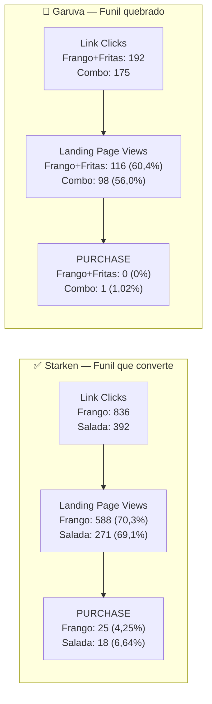

# Primeira Análise — Madrugão Garcia
### Análise de Performance · Últimos 90 dias (27/02 → 27/05/2026)
*Conduzida por: Pedro Sobral Clone · Via Fenice Lab*

---

> [!abstract] Base de dados
> Conta: `910709251642787` · Business: Madrugão Lanches I · Período: 90 dias
> Gasto total analisado: **R$ 2.151,93** · Campanhas: 7 (5 com dados, 2 sem spend)
> Campanhas de vendas com ROAS real: **2** (X-FRANGO-DOBRO e X-SALADA-DOBRO)

---

## Resumo Executivo

Cara, primeiro a verdade nua: a conta tá gastando R$ 2.151 nos 90 dias e voltando com ROAS médio de 2,30x nas campanhas de venda — isso é OK pra hamburgueria local, mas tá longe de escalar com folga. O **X-FRANGO-DOBRO** é o cavalo dessa corrida (ROAS 2,42x, CPA R$ 27,59, 25 vendas), e o **X-SALADA-DOBRO** tá segurando junto (2,08x). Agora o lado feio: **Garuva queimou R$ 616** entre as duas campanhas e trouxe 1 venda — isso não é problema de Meta Ads, é problema de oferta ou de mercado. A campanha de RECO tá gastando R$ 427 com CTR de 0,30%, ou seja, tá comprando alcance barato mas ninguém clica — precisa decidir se é branding ou se vai pro lixo. E o sinal amarelo piscando forte: **frequência 3,40 no X-FRANGO-DOBRO** — público tá saturando, hora de injetar criativo novo antes de morrer.

> [!tip] Veredito geral
> Conta saudável no eixo Starken/X-FRANGO, com vazamento claro em Garuva e desperdício em awareness. Não é pra desesperar — é pra cortar o que não bate e dobrar no que tá batendo.

---

## Ranking das Campanhas

| # | Campanha | Gasto | Purchases | CPA | ROAS | CTR | Freq | Veredito |
|---|---|---|---|---|---|---|---|---|
| 1 | STARKEN X-FRANGO-DOBRO | R$ 689,63 | **25** | R$ 27,59 | **2,42x** | **1,16%** | 3,40 ⚠️ | 🏆 WINNER |
| 2 | STARKEN X-SALADA-DOBRO | R$ 398,37 | **18** | R$ 22,13 | **2,08x** | **1,06%** | 2,65 | ✅ OK |
| 3 | GARUVA FRANGO+FRITAS+REFRI | R$ 281,59 | **0** | N/A | **0x** | 0,74% | 2,21 | 🔴 PROBLEMA |
| 4 | GARUVA COMBO X-FRANGO | R$ 335,34 | **1** | R$ 335,34 | **0,17x** | 0,63% | 2,19 | 💀 DESASTRE |
| 5 | STARKEN TRAFEGO RECO | R$ 427,41 | 5 (view) | N/A | N/A | 0,30% | 2,60 | ❓ DUVIDOSO |
| 6 | STARKEN RECO 28/05 | R$ 18,59 | 0 | — | — | — | 1,08 | Em teste |
| 7 | HAMBURGER DAY 28/05 | R$ 0,00 | — | — | — | — | — | 🟢 Ativa hoje |

> [!warning] Leitura do ranking
> Dos R$ 2.151 gastos, R$ 1.087 (50%) estão nas campanhas que **VOLTAM dinheiro**. Os outros 50% estão divididos entre Garuva (queimando) e Reco (incerto). Isso é alocação de capital ruim — tem que rebalancear.

---

## Análise do Funil — Onde tá vazando

| Campanha | Link Clicks | LPV | Purchase | Click→LPV | LPV→Purchase | Click→Purchase |
|---|---|---|---|---|---|---|
| Starken X-FRANGO-DOBRO | 836 | 588 | 25 | 70,3% | 4,25% | **2,99%** |
| Starken X-SALADA-DOBRO | 392 | 271 | 18 | 69,1% | 6,64% | **4,59%** |
| Garuva FRANGO+FRITAS | 192 | 116 | 0 | 60,4% | 0% | **0%** |
| Garuva COMBO | 175 | 98 | 1 | 56,0% | 1,02% | **0,57%** |

> [!danger] Onde tá o vazamento real
> A taxa Click→LPV em Starken é **69-70%**. Na Garuva caiu pra **56-60%** — ou velocidade de site, link quebrado, ou anúncio promete coisa que a página não entrega. MAS o vazamento **DESTRUIDOR** é LPV→Purchase: Starken converte **4-6%** da página em venda. Garuva converte **0-1%**.
>
> Isso NÃO é problema de tráfego. É problema de **oferta** ou **produto** ou **área de entrega**. Criativo novo em Garuva não vai salvar — antes disso, precisa entender o porquê do funil estar entupido pós-clique.

---

## Padrões que os Dados Revelam

### CPM base do mercado dessa conta

| Campanha | CPM | Interpretação |
|---|---|---|
| Starken Vendas | R$ 6,08 – 6,14 | Consistente · público qualificado a preço justo |
| Garuva Vendas | R$ 7,06 – 7,09 | **16% mais caro** que Starken · praça menor, leilão menos eficiente |
| Reco (Awareness) | R$ 2,62 | Normal para awareness · volume alto, intenção baixa |

### Sinais de público

- Frequência subindo em X-FRANGO-DOBRO (**3,40**) mas X-SALADA ainda em 2,65 → frango rodando mais tempo no mesmo público
- Garuva com freq 2,2 e ainda sem converter → **não é saturação, é oferta crua**
- CPC Garuva (R$ 0,96 a R$ 1,13) quase **2x** o CPC Starken (R$ 0,53 a R$ 0,58) → criativo de Garuva não tem qualidade de hook

### Padrão produto

- Combo "dobro" (sanduíche + alguma coisa) **vendendo MELHOR** que combo completo (sanduíche + fritas + refri) → ticket mais alto pode estar afastando, ou comunicação errada
- X-SALADA convertendo **MELHOR** que X-FRANGO em % (4,59% vs 2,99%) → vale investigar se é ticket menor ou público diferente

> [!note] Insight Pedro Sobral
> A conta tem dois mercados (Starken e Garuva) com comportamento **OPOSTO** no mesmo conceito de oferta. Isso significa que a oferta Starken **não é exportável** pra Garuva sem adaptação. Não é "rodar a mesma campanha em outra praça" — é construir oferta nova pra Garuva.

---

## Sinais de Alerta

> [!warning] Frequência 3,40 — X-FRANGO-DOBRO
> Tá no limite. Acima de 4 começa a degradar performance e CPM sobe. Próximos 7-14 dias: ou injeta **3-5 criativos novos** no mesmo conceito, ou expande público (lookalike novo, interesse adjacente), ou começa a perder eficiência. Não mexe em estrutura — alimenta com criativo.

> [!danger] Garuva — R$ 616 gastos e 1 venda
> ROAS 0,17x = pra cada R$ 1 que entra, sai R$ 5,88. Pausar as duas campanhas Garuva até reformular oferta. Não é teimar com criativo novo — é repensar produto/preço/comunicação pra praça de Garuva.

> [!danger] COMBO X-FRANGO Garuva — CPA R$ 335,34
> CPA de R$ 335 numa hamburgueria? Nem o LTV de um cliente recorrente justifica isso. Pausa hoje. Sem cerimônia.

> [!warning] RECO (awareness) — CTR 0,30%
> R$ 427 gastos comprando impressão. Os 5 purchases atribuídos são view-through — não conta como performance direta. Precisa decidir: **branding com remarketing estruturado atrás** (aí faz sentido) ou **mata e realoca verba** pro que já converte.

---

## Benchmark pro Hamburger Day (e próximas campanhas)

Esses são os números que vou olhar pra dizer se a campanha de hoje — ou qualquer próxima campanha de vendas — tá boa, ruim ou pra matar.

| Métrica | 🔴 Pra matar | 🟡 Aceitável | 🟢 Meta saudável | 🏆 Excelente |
|---|---|---|---|---|
| **CPM** | > R$ 9,00 | R$ 7,00 – 9,00 | R$ 5,50 – 7,00 | < R$ 5,50 |
| **CPC** | > R$ 0,80 | R$ 0,70 – 0,80 | R$ 0,50 – 0,70 | < R$ 0,45 |
| **CTR** | < 0,70% | 0,70 – 0,90% | 0,90 – 1,20% | > 1,30% |
| **Click→LPV** | < 55% | 55 – 65% | 65 – 72% | > 72% |
| **LPV→Purchase** | < 2% | 2 – 4% | 4 – 6% | > 6,5% |
| **CPA** | > R$ 40 | R$ 30 – 40 | R$ 20 – 30 | < R$ 20 |
| **ROAS** | < 1,5x | 1,5 – 2,0x | 2,0 – 2,5x | > 3,0x |
| **Frequência** | > 4,0 | 3,5 – 4,0 | 2,5 – 3,5 | < 2,5 |

> [!tip] Critério especial para datas comemorativas (Hamburger Day, etc)
> Em evento com urgência real, espera-se conversão **ACIMA** do dia normal. Então o limiar sobe:
> - CPA < R$ 22 e ROAS > 2,5x → campanha venceu, escala pro próximo evento
> - CPA R$ 22-30 e ROAS 2,0-2,5x → OK, refina criativo pra próxima
> - CPA > R$ 30 ou ROAS < 2,0x em evento comemorativo → algo errado (criativo, oferta ou competição)
>
> **Regra de ouro:** mínimo de dados suficientes antes de qualquer decisão. Com R$ 50 de budget numa janela de 10h, você não vai ter 50 conversões pra validar otimização — use CTR e LPV como proxy de interesse e PURCHASE como bônus validador.

---

## 3 Recomendações Prioritárias

### 🔴 Prioridade 1 — Pausar hoje as duas campanhas Garuva

Não é "ajusta criativo", não é "muda público". **Pausa.** R$ 616 com ROAS 0,17 já é dado suficiente. Antes de qualquer real novo lá, reunião com cliente pra entender: tem entrega em Garuva? Tempo de entrega? Concorrência? Ticket faz sentido pra praça?

**Critério de sucesso:** liberar R$ 600/mês do buraco e realocar nas Starken vencedoras.

| | Antes | Depois |
|---|---|---|
| Gasto Garuva/mês | ~R$ 200 | R$ 0 (pausado) |
| Verba liberada | — | +R$ 200/mês pro X-FRANGO-DOBRO |
| ROAS esperado do realocado | 0,17x | 2,42x |

---

### 🟡 Prioridade 2 — Injetar 3-5 criativos novos no X-FRANGO-DOBRO

Frequência 3,40 é alerta amarelo piscando. NÃO mexe em estrutura. NÃO muda público. Só **entra com criativo novo** no mesmo conceito (X-FRANGO em dobro): variação de hook, ângulo de fome, prova social de cliente, comparação de preço.

**Critério de sucesso:** manter CPA < R$ 30 e derrubar frequência pra menos de 3,0 em 14 dias.

---

### 🟡 Prioridade 3 — Decidir o destino da campanha RECO

Duas opções, não tem meio-termo:

**Opção A:** Manter, MAS criar campanha de remarketing dedicada pra quem foi alcançado (Custom Audience de engajamento + visitantes). Aí ela ganha sentido como topo de funil — e você mede o ROAS **combinado** da RECO + remarketing.

**Opção B:** Pausar e realocar os ~R$ 4,75/dia nas Starken-Venda que já performam.

**Critério de decisão:** se em 30 dias a RECO + remarketing não fechar ROAS combinado de 1,5x, mata. Branding em conta pequena tem que ter retorno tangível.

---

## Conclusão

> [!quote] Pedro Sobral
> "Conta tem que fechar. X-FRANGO e X-SALADA tão fechando. Garuva tá ABRINDO buraco. RECO tá em dúvida. Mata o que não bate, escala o que bate, e PARA de espalhar verba em frente que não converte. Configuração não vai salvar oferta ruim em Garuva — é problema de oferta, não de tráfego. Saca?"

---

## Links desta análise

| Documento | Descrição |
|---|---|
| [[Garcia/00 - Visão Geral\|Visão Geral Garcia]] | Identidade digital + targeting padrão |
| [[Garcia/Conta de Anúncios\|Conta de Anúncios]] | IDs técnicos + status MCP |
| [[Garcia/Públicos Salvos\|Públicos Salvos]] | JSON do público Garcia #1 |
| [[Garcia/Campanhas/2026-05-28 Hamburger Day/🍔 Campanha Visual — Hamburger Day\|Campanha Hamburger Day]] | One-pager visual da campanha atual |
| [[Garcia/Campanhas/2026-05-28 Hamburger Day/02 - Monitoramento em Tempo Real\|Monitoramento Hamburger Day]] | Cronograma de checks ao vivo |

---

*Análise gerada em: 2026-05-28 · Fenice Lab — Pedro Sobral Clone*
*Próxima revisão: após postmortem do Hamburger Day (29/05)*
